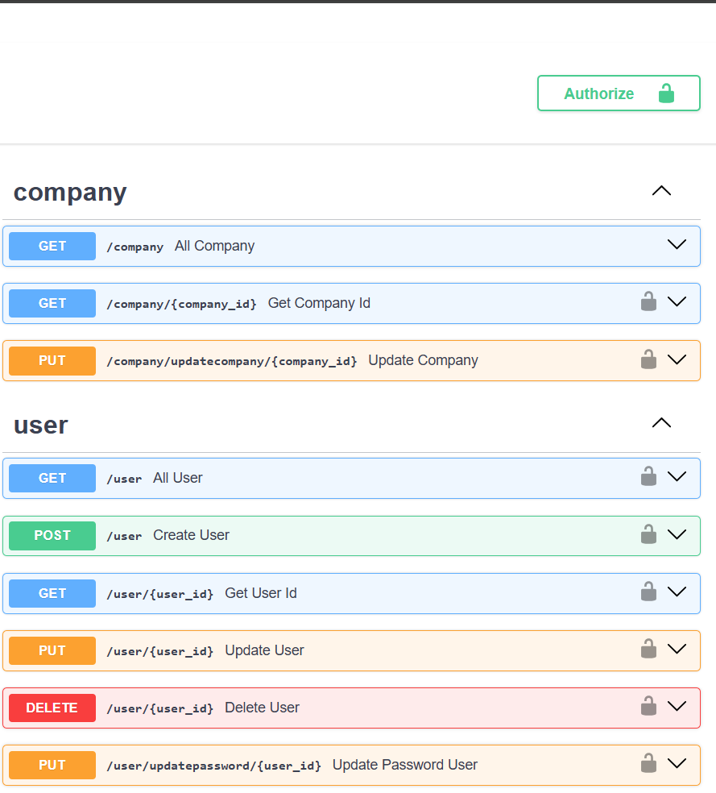
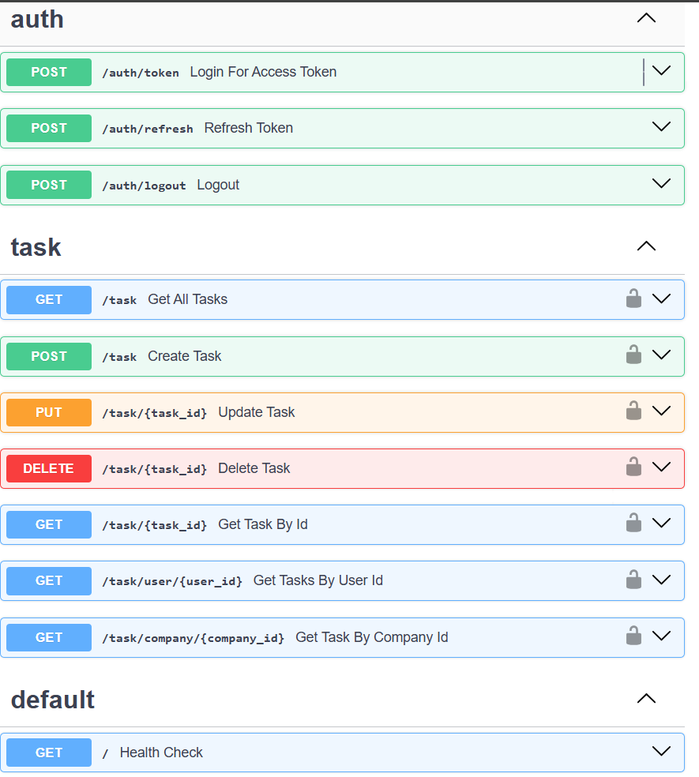

# Stack
Backend: Fastapi

Database: Postgres

Cache: Redis

Authorization: JWT

## Run on devcontainer
https://code.visualstudio.com/docs/devcontainers/containers
## Run on docker compose
update environment on docker-compose.yaml

```
      JWT_SECRET: replaceme
      DEFAULT_PASSWORD: replaceme
      REDIS_PASS: replaceme
```




